## 📸 Project Screenshots

### 🏠 Home Page
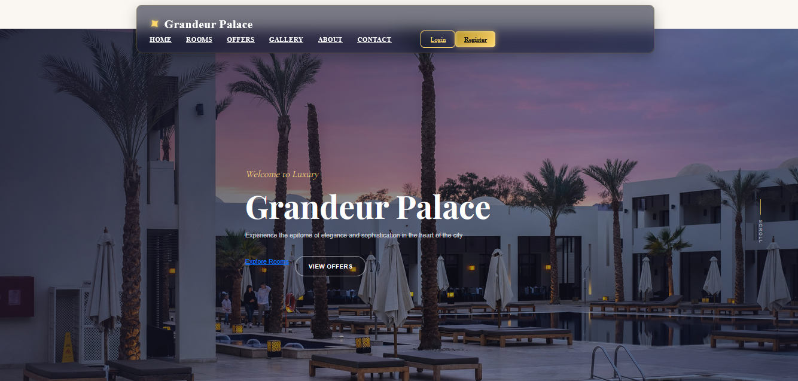
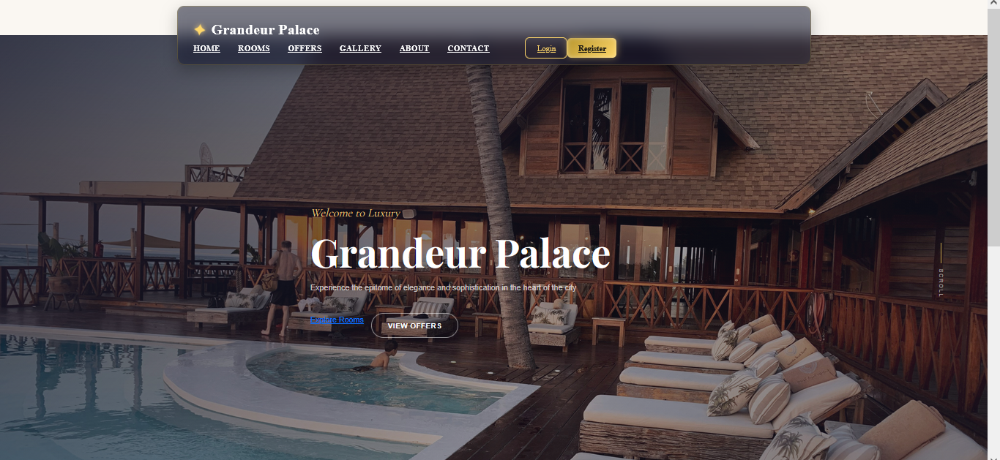
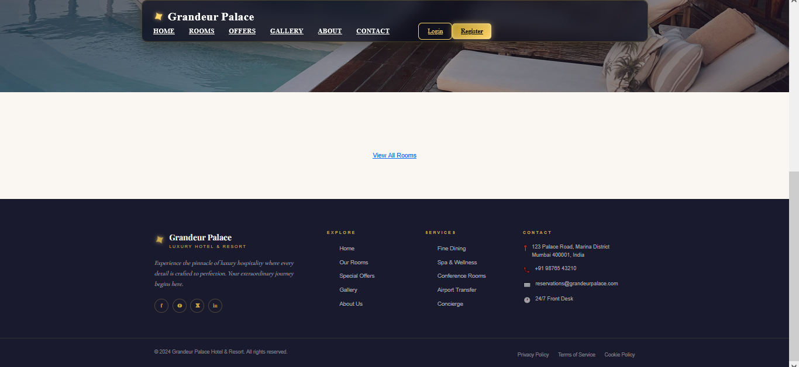

### 🏨 Rooms Page
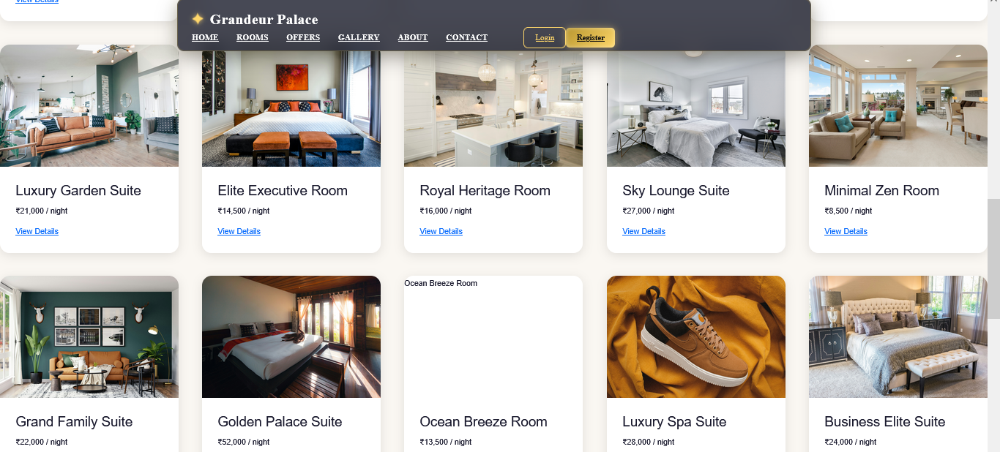
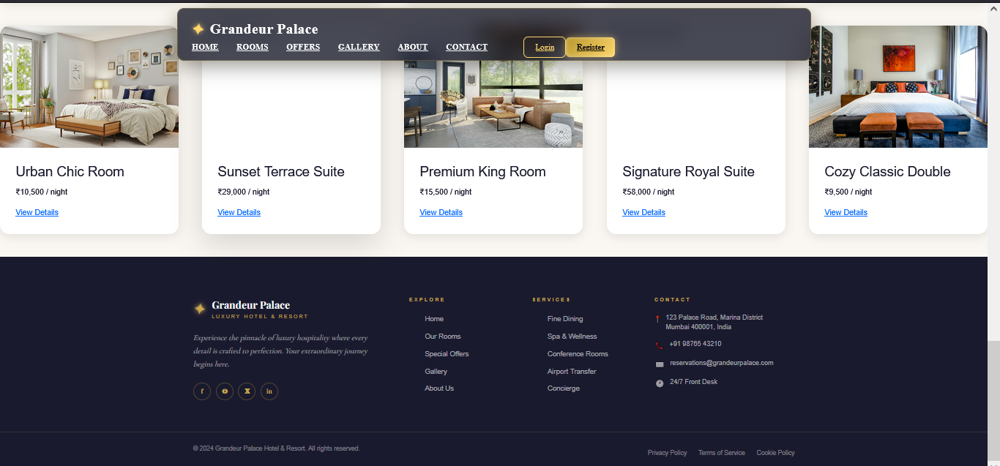

### 🎁 Offers Page
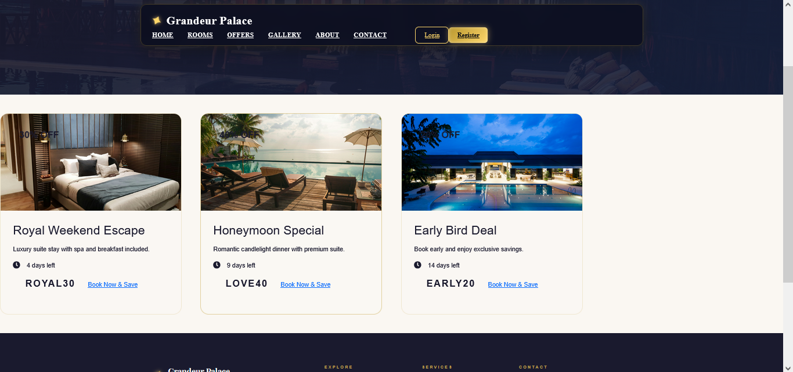

### 🖼️ Gallery Page
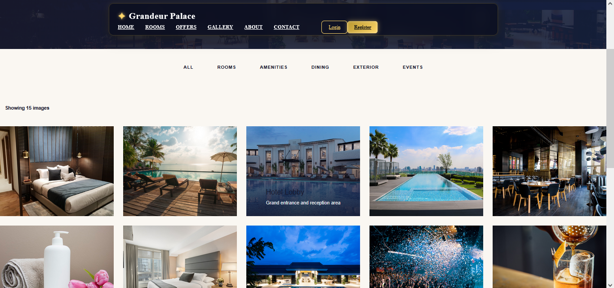
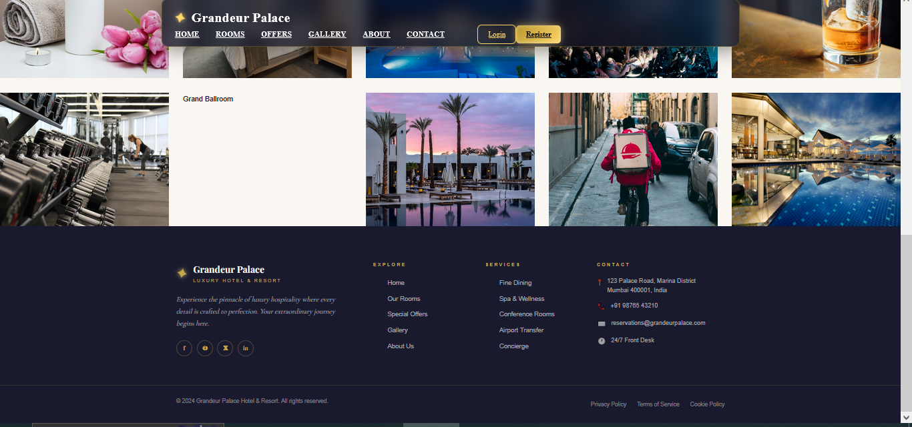

### ℹ️ About Page
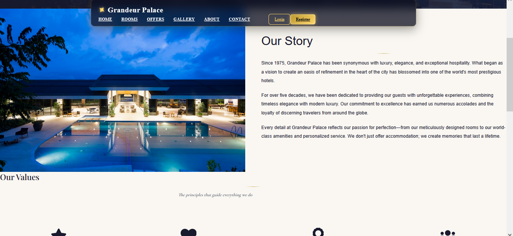
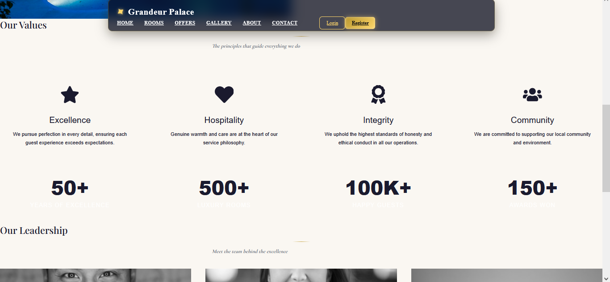
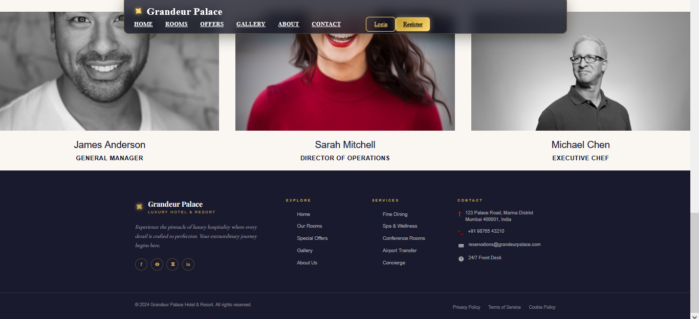

### 📞 Contact Page
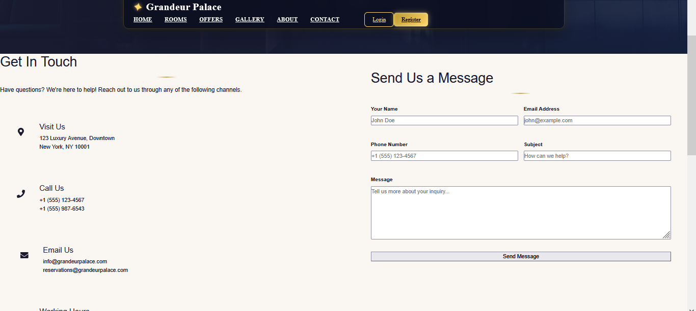
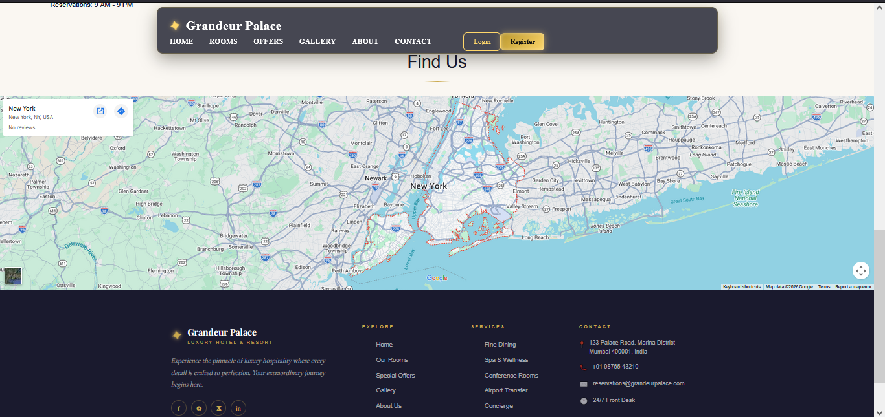

### 🔐 Login Page
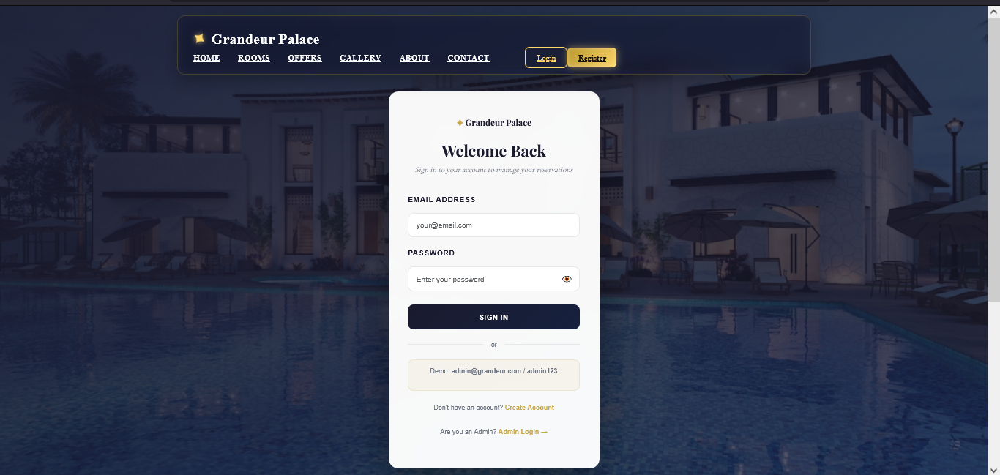

### 📝 Registration Page
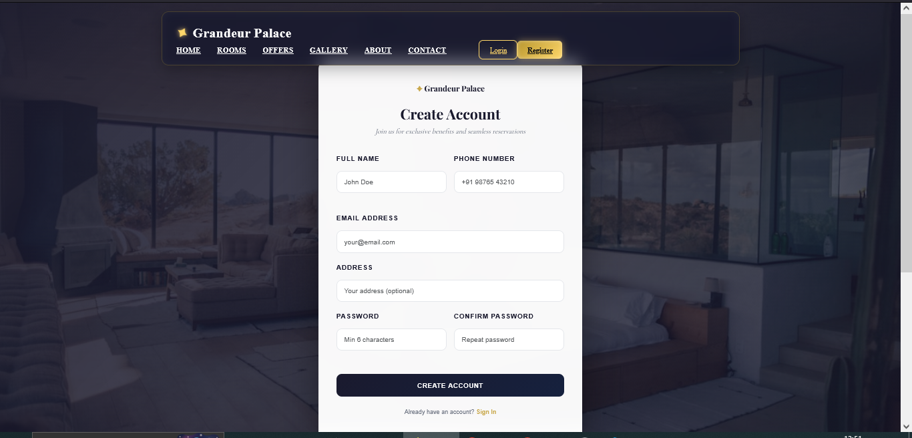

### 📷 Additional Screenshots
.png)
.png)
.png)
# 📁 All Code Files - Separate Files Directory

This directory contains **ALL 30 code files** as separate, individual files with their exact filenames and complete code.

## 📂 Directory Structure

```
all-code-files/
│
├── backend/                          (15 files)
│   ├── package.json
│   ├── .env.example
│   ├── server.js
│   │
│   ├── config/
│   │   └── db.js
│   │
│   ├── middleware/
│   │   └── auth.js
│   │
│   ├── models/
│   │   ├── User.js
│   │   ├── Room.js
│   │   ├── Booking.js
│   │   ├── Offer.js
│   │   └── Gallery.js
│   │
│   └── routes/
│       ├── auth.js
│       ├── rooms.js
│       ├── bookings.js
│       ├── offers.js
│       └── gallery.js
│
└── frontend/                         (15 files)
    ├── package.json
    │
    ├── public/
    │   └── index.html
    │
    └── src/
        ├── index.js
        ├── App.js
        │
        ├── components/
        │   ├── Navbar.js
        │   ├── Navbar.css
        │   ├── Footer.js
        │   └── Footer.css
        │
        ├── pages/
        │   ├── Home.js
        │   ├── Home.css
        │   ├── Login.js
        │   ├── Register.js
        │   └── Auth.css
        │
        ├── context/
        │   └── AuthContext.js
        │
        └── styles/
            └── App.css
```

## ✅ Complete File List (30 Files)

### Backend Files (15)
1. `backend/package.json` - Dependencies & scripts
2. `backend/.env.example` - Environment variables template
3. `backend/server.js` - Main server file
4. `backend/config/db.js` - Database configuration
5. `backend/middleware/auth.js` - Authentication middleware
6. `backend/models/User.js` - User model
7. `backend/models/Room.js` - Room model
8. `backend/models/Booking.js` - Booking model
9. `backend/models/Offer.js` - Offer model
10. `backend/models/Gallery.js` - Gallery model
11. `backend/routes/auth.js` - Auth routes
12. `backend/routes/rooms.js` - Room routes
13. `backend/routes/bookings.js` - Booking routes
14. `backend/routes/offers.js` - Offer routes
15. `backend/routes/gallery.js` - Gallery routes

### Frontend Files (15)
1. `frontend/package.json` - Dependencies & scripts
2. `frontend/public/index.html` - HTML template
3. `frontend/src/index.js` - React entry point
4. `frontend/src/App.js` - Main app component
5. `frontend/src/components/Navbar.js` - Navigation component
6. `frontend/src/components/Navbar.css` - Navbar styles
7. `frontend/src/components/Footer.js` - Footer component
8. `frontend/src/components/Footer.css` - Footer styles
9. `frontend/src/pages/Home.js` - Home page
10. `frontend/src/pages/Home.css` - Home page styles
11. `frontend/src/pages/Login.js` - Login page
12. `frontend/src/pages/Register.js` - Register page
13. `frontend/src/pages/Auth.css` - Auth pages styles
14. `frontend/src/context/AuthContext.js` - Auth context
15. `frontend/src/styles/App.css` - Global styles

## 🚀 How to Use These Files

### Option 1: Copy All Files Directly
```bash
# Create your project directory
mkdir hotel-management
cd hotel-management

# Copy the entire backend and frontend folders
cp -r /path/to/all-code-files/backend ./
cp -r /path/to/all-code-files/frontend ./
```

### Option 2: Manual Setup
1. Create the directory structure:
   ```bash
   mkdir -p backend/{config,middleware,models,routes}
   mkdir -p frontend/{public,src/{components,pages,context,styles}}
   ```

2. Copy each file to its corresponding location

3. Install dependencies:
   ```bash
   cd backend && npm install
   cd ../frontend && npm install
   ```

### Option 3: Download and Extract
Simply download this entire `all-code-files` folder and rename it to `hotel-management`

## 📋 Quick Start After Copying

1. **Configure Backend:**
   ```bash
   cd backend
   cp .env.example .env
   # Edit .env with your MongoDB URI and JWT secret
   ```

2. **Install Dependencies:**
   ```bash
   # Backend
   cd backend
   npm install

   # Frontend
   cd ../frontend
   npm install
   ```

3. **Start Development Servers:**
   ```bash
   # Terminal 1 - Backend
   cd backend
   npm run dev

   # Terminal 2 - Frontend
   cd frontend
   npm start
   ```

## 📦 What Each File Contains

### Configuration Files
- **package.json**: All npm dependencies and scripts
- **.env.example**: Environment variable template

### Backend Files
- **server.js**: Express server setup with all routes
- **config/db.js**: MongoDB connection logic
- **middleware/auth.js**: JWT authentication & authorization
- **models/*.js**: Mongoose schemas for database
- **routes/*.js**: API endpoints for each resource

### Frontend Files
- **index.html**: HTML template with fonts
- **index.js**: React DOM rendering
- **App.js**: Main app with routing
- **components/*.js**: Reusable React components
- **pages/*.js**: Page components
- **context/*.js**: State management
- **styles/*.css**: CSS styling

## 🎨 Features Included

✅ JWT Authentication
✅ Role-based Access Control
✅ User Registration & Login
✅ Room Management (CRUD)
✅ Booking System
✅ Offers & Discounts
✅ Gallery Management
✅ Luxury UI Design
✅ Fully Responsive
✅ Smooth Animations
✅ Professional Styling

## 🔑 Important Notes

1. **Change JWT Secret**: Before deploying, change `JWT_SECRET` in `.env`
2. **MongoDB**: Ensure MongoDB is installed and running
3. **Node Version**: Use Node.js v14 or higher
4. **Port Configuration**: Backend runs on port 5000, Frontend on 3000

## 📞 Need Help?

Refer to:
- `QUICKSTART.md` - Quick 5-minute setup guide
- `INSTALLATION.md` - Detailed installation instructions
- `README.md` - Complete project documentation

---


**All 30 files are ready to use! Just copy and start building! 🚀**

